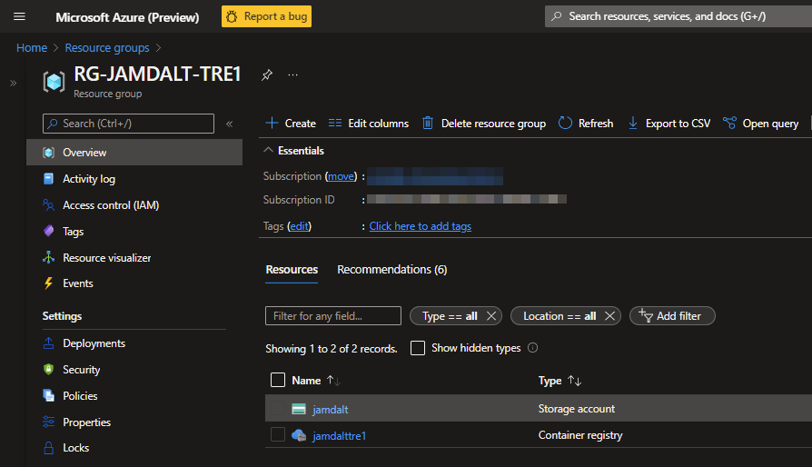
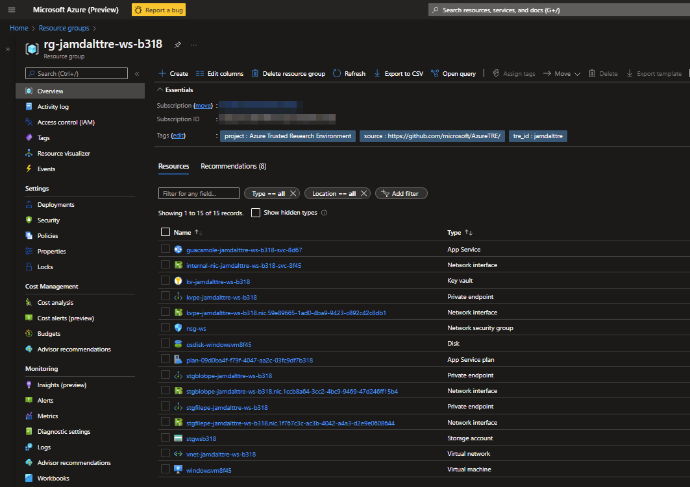

# Azure TRE Resource Breakdown

The Azure services deployed within an Azure TRE are described below.

Once an Azure TRE has been [provisioned](../../tre-admins/setup-instructions/pre-deployment-steps) in an Azure Subscription, you will have two Resource Groups:

1. Azure TRE Management Resource Group - Pre-requisiste for deploying an Azure TRE instance
1. Azure TRE Resource Group - Core Azure TRE instance

## Azure TRE Management Resource Group

| Name | Azure Service | Description | Additional links
|---|---|---|---|
| {MGMT_STORAGE_ACCOUNT_NAME} | Storage Account | [Azure TRE Terraform and Porter state](../../tre-admins/setup-instructions/pre-deployment-steps)  | [Storage Blobs](https://docs.microsoft.com/en-us/azure/storage/blobs/storage-blobs-overview)
| {ACR_NAME} | Container Registry | [Azure TRE container images (Porter bundles)](../architecture/#composition-service) | [Container Registry](https://docs.microsoft.com/en-gb/azure/container-registry/container-registry-intro)

## Azure TRE Resource Group

| Name | Azure Service | Description | Additional links
|---|---|---|---|
| api-{TRE_ID} | App Service | [Azure TRE Python api](../../tre-developers/api) responsible for all operations on Workspaces and managing Workspace Templates built using the FastAPI framework | [FastAPI](https://fastapi.tiangolo.com/) |
| gitea-{TRE_ID} | App Service | [Azure TRE Source Mirror](../shared-services/gitea) - allows mirroring git repositories | [Gitea](https://gitea.io/)
| nexus-{TRE_ID} | App Service | [Azure TRE Package Mirror](../shared-services/nexus) - allows mirroring packages | [Sonatype Nexus](https://www.sonatype.com/products/repository-oss)
| plan-{TRE_ID} | App Service Plan | Compute resources in which the TRE app services run | [App Hosting plans](https://docs.microsoft.com/en-us/azure/app-service/overview-hosting-plans)
| agw-{TRE_ID} | Azure Application Gateway | [Azure TRE App Gateway](../architecture) provides single public IP address with SSL for accessing core TRE resources | [Azure Application Gateway](https://docs.microsoft.com/en-us/azure/application-gateway/overview)
| appi-{TRE_ID} | Application Insights | Telemetry for all API invocations | [Application Insights](https://docs.microsoft.com/en-us/azure/azure-monitor/app/app-insights-overview)
| cosmos-{TRE_ID} | Azure Cosmos DB Account | NoSQL state store of TRE resources, templates and operations | [Cosmos DB](https://docs.microsoft.com/en-us/azure/cosmos-db/introduction)
| mysql-{TRE_ID} | Azure Database for MySQL server | SQL state store for Gitea | [Gitea Database](https://docs.gitea.io/en-us/database-prep)
| ampls-{TRE_ID} | Azure Monitor Private Link Scope | Provides secure link between PaaS resources and the TRE vnet using private endpoints | [Azure Monitor Private Link Scope](https://docs.microsoft.com/en-us/azure/azure-monitor/logs/private-link-security)
| bas-{TRE_ID} | Azure Bastion | Provides secure access for RDP/SSH to TRE VM (jumpbox) | [Azure Bastion](https://docs.microsoft.com/en-us/azure/bastion/bastion-overview)
| vm-dsk-{TRE_ID} | Disk | Managed storage disk for TRE VM (jumpbox) | [Managed Disks](https://docs.microsoft.com/en-us/azure/virtual-machines/managed-disks-overview)
| fw-dsk-{TRE_ID} | Azure Firewall | [Azure TRE Firewall](../networking) restricts external outbound traffic from all TRE resources | [Azure Firewall](https://docs.microsoft.com/en-us/azure/firewall/overview)
| kv-{TRE_ID} | Azure Key Vault | Management of TRE secrets & certificates | [Azure Key Vault](https://docs.microsoft.com/en-us/azure/key-vault/general/overview)
| log-{TRE_ID} | Log Analytics Workspace | Azure Monitor Logs store for all TRE resources | [Log Analytics](https://docs.microsoft.com/en-us/azure/azure-monitor/logs/data-platform-logs#log-analytics-workspaces)
| id-agw-{TRE_ID} | Managed Identity | User-managed identity for TRE Application Gateway | [Managed Identities](https://docs.microsoft.com/en-us/azure/active-directory/managed-identities-azure-resources/overview)
| id-api-{TRE_ID} | Managed Identity | User-managed identity for TRE API App Service | [Managed Identities](https://docs.microsoft.com/en-us/azure/active-directory/managed-identities-azure-resources/overview)
| id-gitea-{TRE_ID} | Managed Identity | User-managed identity for TRE Gitea App Service | [Managed Identities](https://docs.microsoft.com/en-us/azure/active-directory/managed-identities-azure-resources/overview)
| id-vmss-{TRE_ID} | Managed Identity | User-managed identity for TRE Resource Processer (VMSS) | [Managed Identities](https://docs.microsoft.com/en-us/azure/active-directory/managed-identities-azure-resources/overview)
| sb-{TRE_ID} | Service Bus Namespace | Messaging for TRE API | [Service Bus](https://docs.microsoft.com/en-us/azure/service-bus-messaging/service-bus-messaging-overview)
| stappinsights{TRE_ID} | Storage Account | Storage for TRE Application Insights telemetry logs | [Storage Blobs](https://docs.microsoft.com/en-us/azure/storage/blobs/storage-blobs-overview)
| stg{TRE_ID} | Storage Account | Files shares for TRE services such as Porter, Gitea, Nexus | [Storage Files](https://docs.microsoft.com/en-us/azure/storage/files/storage-files-introduction)
| stweb{TRE_ID} | Storage Account | Storage for [Azure TRE Let's Encrypt](../../tre-admins/setup-instructions/deploying-azure-tre) | [Storage Blob](https://docs.microsoft.com/en-us/azure/storage/blobs/storage-blobs-overview)
| vm-{TRE_ID} | Virtual Machine | [Azure TRE VM (jumpbox)](https://microsoft.github.io/AzureTRE/tre-admins/setup-instructions/configuring-shared-services) | [Windows Virtual Machine](https://docs.microsoft.com/en-us/azure/virtual-machines/windows/overview)
| vm-{TRE_ID} | Virtual Machine Scale Set | [Azure TRE Resource Processor](../../tre-developers/resource-processor) | [Virtual Machine Scale Sets](https://docs.microsoft.com/en-us/azure/virtual-machine-scale-sets/overview)
| vnet-{TRE_ID} | Virtual Network | [Azure TRE VNET central hub](../networking) | [Virtual Networks](https://docs.microsoft.com/en-us/azure/virtual-network/virtual-networks-overview)
| rt-{TRE_ID} | Route Table | Azure TRE route table | [Route Tables](https://docs.microsoft.com/en-us/azure/virtual-network/manage-route-table)

!!! note
    Network resources such as Network Interfaces, Network Security Groups, Private Endpoints, Private DNS zones and Public IP addresses are not listed above.

## Azure TRE Workspace Resource Group

A TRE Workspace will be provisioned in a separate Resource Group along with its own resources.  An example TRE Workspace is shown and described here.

| Name | Azure Service | Description | Additional links
|---|---|---|---|
| guacamole-{TRE_ID}-ws-XXXX-svc-XXXX | App Service | [RDP](../../tre-templates/workspace-services/guacamole) for accessing workspace VMs | [Apache Guacamole](https://guacamole.apache.org)
| kv-{TRE_ID}-ws-XXXX | Azure Key Vault | Management of TRE workspace secrets & certificates | [Azure Key Vault](https://docs.microsoft.com/en-us/azure/key-vault/general/overview)
| osdisk-windowsvm8f45 | Disk | Azure VM storage disk | [Managed Disks](https://docs.microsoft.com/en-us/azure/virtual-machines/managed-disks-overview)
| plan-09d0ba4f-f79f-4047-aa2c-03fc9df7b318 | App Service plan | Compute resources in which the workspace app services (Gitea) run | [App Hosting Plans](https://docs.microsoft.com/en-us/azure/app-service/overview-hosting-plans)
| stgwsb318 | Storage account | Workspace Storage account | [Storage Blobs](https://docs.microsoft.com/en-us/azure/storage/blobs/storage-blobs-overview)
| vnet-{TRE_ID}-ws-XXXX | Virtual Network | [Azure TRE VNET spoke](../networking) | [Virtual Networks](https://docs.microsoft.com/en-us/azure/virtual-network/virtual-networks-overview)
| windowsvm8f45 | Virtual Machine | [Windows VM instance](../../tre-templates/user-resources/guacamole-windows-vm) for research | [Windows Virtual Machine](https://docs.microsoft.com/en-us/azure/virtual-machines/windows/overview)

!!! note
    Network resources such as Network Interfaces, Network Security Groups and Private Endpoints are not listed above.

## Running costs

The exact running costs will depend on the number of workspaces you have deployed, the workspace services you have enabled within them and the Azure Data center region.  You can use the [Azure Pricing Calculator](https://azure.microsoft.com/en-gb/pricing/calculator/) on the above services to get an indicative idea of running costs, or contact your Microsoft representative for further guidance.
